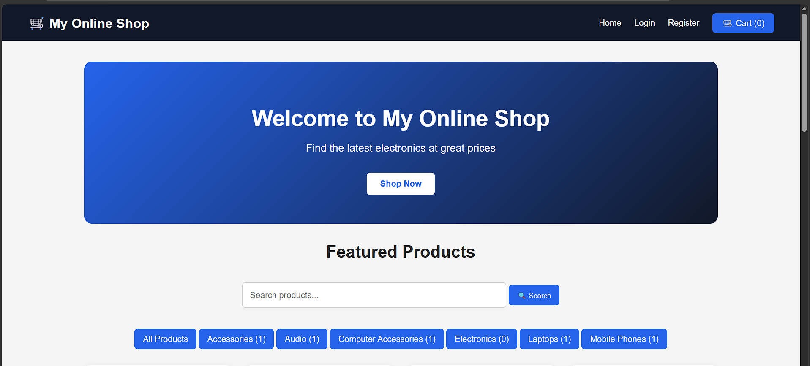
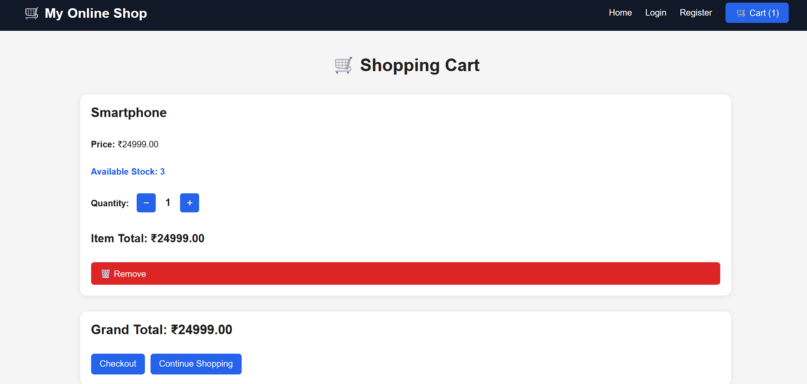
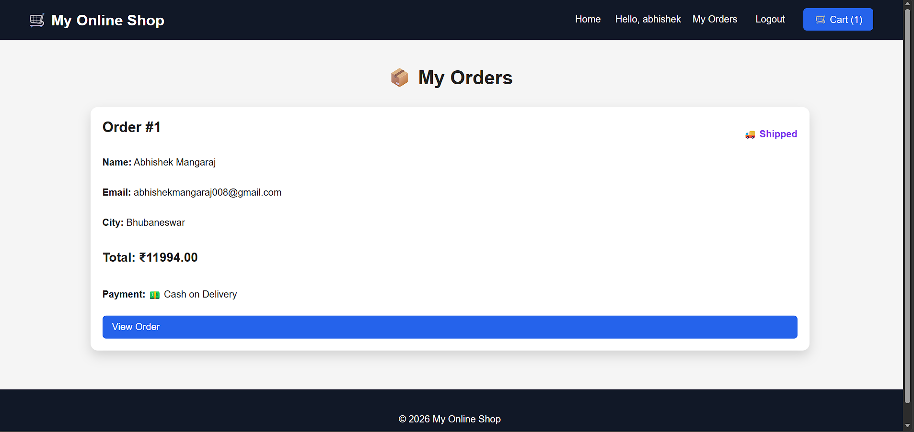

# 🛒 My Online Shop

A full-stack e-commerce web application built with Django and Python.

## 🚀 Features

- User registration, login and logout
- Product listing and product details
- Product search and category filtering
- Shopping cart with quantity management
- Stock and inventory management
- Low-stock and out-of-stock handling
- Checkout and order placement
- Automatic stock reduction after orders
- Order history and order details
- Order status tracking
- Cash on Delivery and online payment status
- Django Admin panel for managing products and orders
- Responsive user interface

## 🛠️ Technologies

- Python
- Django
- HTML5
- CSS3
- SQLite
- Django Templates

## 📁 Project Structure

```text
online-shop/
├── cart/
├── myshop/
├── orders/
├── shop/
├── templates/
├── media/
├── manage.py
├── requirements.txt
├── README.md
└── .gitignore
## 📸 Screenshots

### 🏠 Homepage



### 🛒 Shopping Cart



### 📦 My Orders

